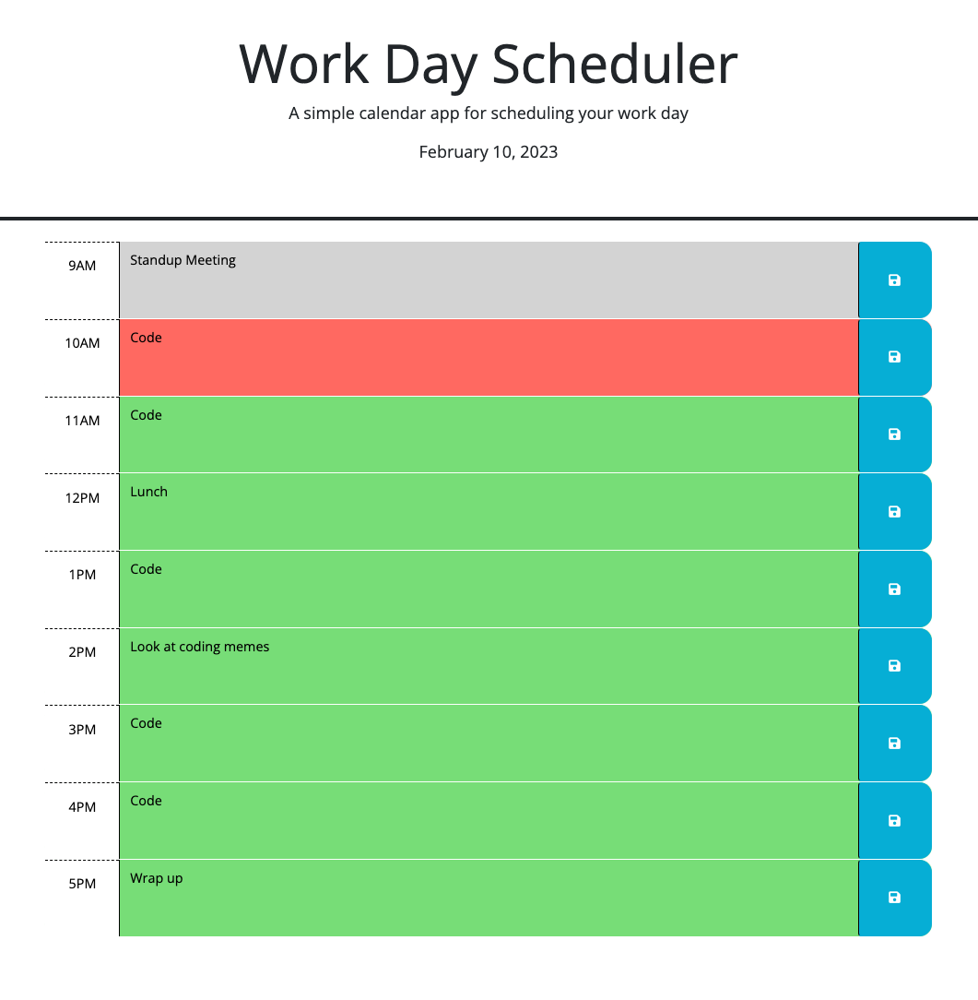
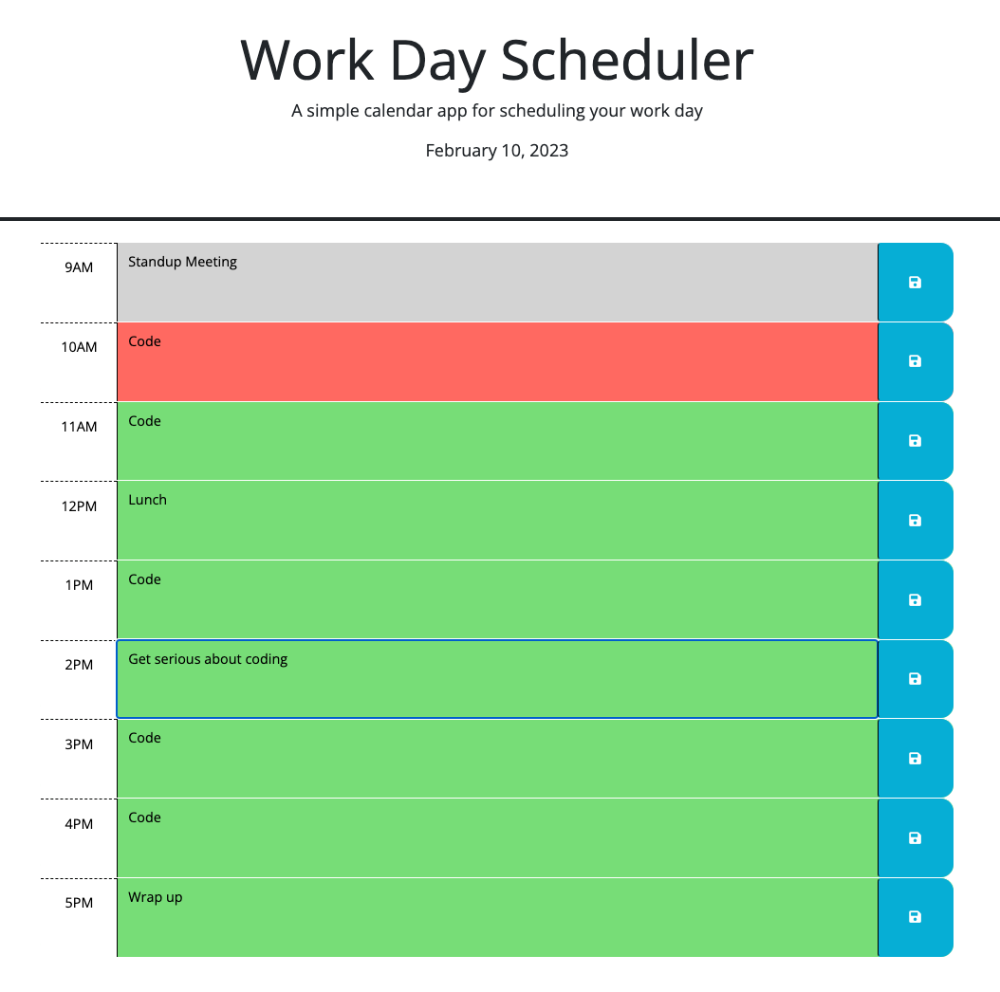

# Work Day Scheduler

## Description
This simple scheduler application was designed for someone with a standard 9-5 day job who wishes to keep track of what tasks they have at every hour of the day. In any of the hour blocks, the user can type in what tasks they have in that hour and click the save icon located to the right of the description box. This feature was implemented with the idea that a user would be able to have their tasks saved to the webpage if it were ever to be closed and reopened. In addition to this, the application has a built-in feature that will display one of three different colors: grey indicates that a time block has already passed, the red indicates the current hour that the user is viewing during that time, while a green time block indicates events to come in the future. 

As shown here, the user has inputted certain tasks they need to do throughout the day. We know that they have already had their standup meeting since it is now a grey block. Currently, they have to code for the hour they are in while everything in the later hours can be seen in green hour blocks. 

The user has since then reevaluated their tasks for the day and sees that they now need to 'get serious about coding' rather than looking at coding memes for an entire hour. With the local storage functionality built-in, it becomes simple for the user to enter a new description into that hour block and save it to the webpage by clicking on the save button located to the right of the description box. This will ensure that the value inside the description box persists upon reloading the page. 

### Deployment Link
